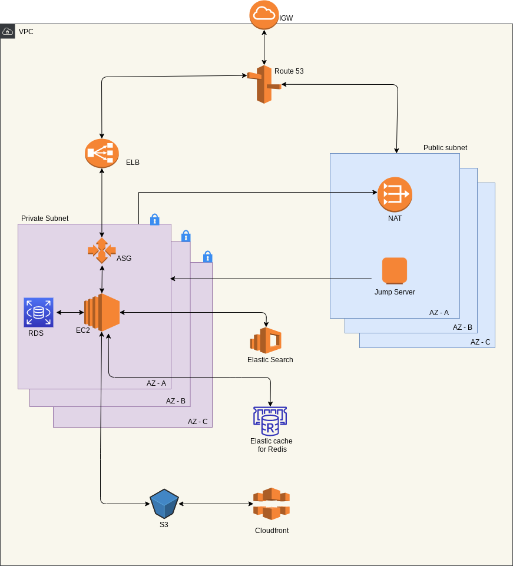
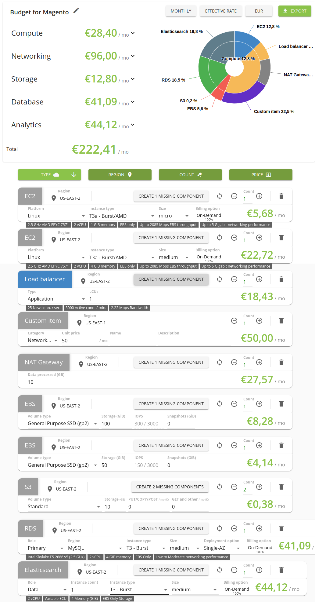

# Magento Cluster on AWS

## What this project is about

- Terraform cloudformation template to create a AWS infrastructure for the architecture shown below.
- Create a VPC with private and public subnets on all availability zones.
- Create a NAT, IGW, route table for all the subnets
- Create S3 buckets for magento static and media files.
- Create a CDN for s3 buckets and create a route53 alias A record.
- Create a ALB, Listener target group and route52 alias A record.
- Create a Redis Elasticache accessible inside the VPC.
- Create an Elastic search accessible inside the VPC.
- Create a IAM policy for EC2 to access the media and static s3 bucket
- Create a mysql RDS instance in private subnets.
- Create a jump server in the pubic subnet to access resources in private subnet.
- Create required security groups for all the resources.
- Pass on created infra details to downstream process
- Packer will build an AMI with all the magento production ready code and update the created infra details. New AMI details will be passed on to deploy-app
- Deploy app will create a launch config and autoscaling group.
- Created the ASG policy and attached the autoscaling group to the target group created earlier.

* Average monthly budget depends on the size of instance we select. For t3a.medium instance average monthly cost comes around €250.

## Architecture



## Sample Budget Estimate.



## Pre Deployment Activity

Install terraform and packer

This terraform template assumes you already have hosted zone added in route53 and have the required ssl certificate for domain and cdn(in us-east-1 region)

In pre-build-custom-ami directory

```bash
cd pre-build-custom-ami
```

create env.json file

```json
{
  "aws_access_key": "",
  "aws_secret_key": "",
  "aws_region": ""
}
```

And run

```bash
chmod +x build.sh
./build.sh
```

In initial-aws-setup

```bash
cd ../initial-aws-setup
ssh-keygen -f magentokey
```

Create the terraform.tfvars file

```tfvars "
AWS_ACCESS_KEY        = " "
AWS_SECRET_KEY        = " "
AWS_REGION            = " "
S3_MEDIA_BUCKET       = " "
S3_STATIC_BUCKET      = " "
CDN_ACM_CERT_ARN      = " "
CDN_FQDN_MEDIA_ALIAS  = " "
CDN_FQDN_STATIC_ALIAS = " "
DOMAIN_ZONE_ID        = " "
CDN_MEDIA_DOMAIN      = " "
CDN_STATIC_DOMAIN     = " "
RDS_PASSWORD          = " "
RDS_INSTANCE_CLASS    = " "
DEVELOPER_ADDR        = " "
RDS_USERNAME          = " "
REDIS_INSTANCE_TYPE   = " "
ES_INSTANCE_TYPE      = " "
ALB_LOG_BUCKET        = " "
AWS_ACCOUNT_ID        = " "
WEB_APP_DOMAIN        = " "
ARTIFACT_USER         = " "
ARTIFACT_PASSWORD     = " "
SQL_ARTIFACT_URL      = " "
DOMAIN_CERT_ARN       = " "
```

In build-app-ami directory

```bash
cd ../build-app-ami
```

create env.json file

```json
{
  "aws_access_key": "",
  "aws_secret_key": "",
  "aws_region": ""
}
```

create app.json file

```json
{
  "ARTIFACT_USER": "",
  "ARTIFACT_PASSWORD": "",
  "APP_ARTIFACT_URL": "",
  "mysql_user": "",
  "mysql_password": "",
  "mysql_db": "",
  "USER_NAME": "",
  "PASSWORD": ""
}
```

In deploy-app directory

```bash
cd ../deploy-app
```

create terraform.tfvars

```tfvars
AWS_ACCESS_KEY = " "
AWS_SECRET_KEY = " "
AWS_REGION     = " "
INSTANCE_TYPE = " "
MAX_SIZE = " "
MIN_SIZE = " "
```

Run magento_setup.sh

```bash
cd ..
chmod +x magento_setup.sh
./magento_setup.sh
```
